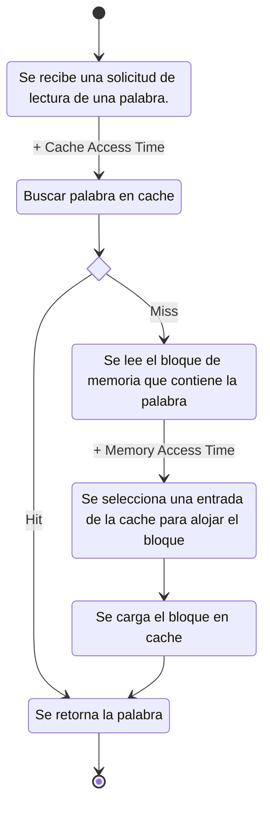

La *jerarquía de memoria* establece un orden en función de la capacidad y velocidad de las memorias. La mayor jerarquía corresponde a la memoria más rápida. Mientras que la menor corresponde a la memoria más lenta.

## Principio de Localidad
El principio de localidad establece que los programas acceden a una porción relativamente reducida del address space en un determinado lapso de tiempo.
- Localidad Temporal: Si un elemento es referenciado en determinado momento, es común que vuelva a ser referenciado poco tiempo después.
- Localidad Espacial: Si un elemento referenciado en determinado momento, es común que los elementos con direcciones “cercanas” también sean accedidos poco tiempo después.

Surgen los siguientes términos:
- Hit: Se dice que ocurre un *hit* cuando un elemento se encuentra en el lugar de la jerarquía donde se lo está buscando.
- Miss: Se dice que ocurre un *miss* cuando un elemento no es encontrado en el lugar de la jerarquía donde se lo está buscando. En este caso es necesario ir a buscar el elemento a un nivel de jerarquía inferior.
- Hit-Rate: Es la tasa de acierto de encontrar un elemento en el lugar de la jerarquía en que se lo busca.
- Miss-Rate: Es la tasa de fallos de encontrar un elemento en el lugar buscado. Observar que se calcula como 1 - *Hit Rate*.
- Hit-Time: Tiempo de acceso promedio en el nivel de jerarquía considerado (donde se da el *hit*).
- Miss-Penalty: Tiempo de acceso promedio adicional requerido para acceder al elemento de información en el nivel de jerarquía inferior. *Típicamente ocurre que __Hit Time__ $<$ __Miss Penalty__.*
- Average Access Time: Se calcula como *__Hit Time__ $+$ __Miss Rate__ $\cdot$ __Miss Penalty__*

Respecto al rendimiento de la memoria:
- Access Time: Tiempo que transcurre entre que la dirección se presenta estable y los datos pueden ser manipulados en forma confiable. *Puede variar dependiendo si es un read o write.*
- Cycle Time: Tiempo mínimo que debe pasar entre un acceso y el siguiente (las memorias requieren de un cierto tiempo de recuperación antes de poder iniciar un nuevo ciclo de acceso).
- Transfer Rate: Velocidad de transferencia de los datos.

## Memoria Cache
La lógica de funcionamiento de la memoria cache es la que se esquematiza en el siguiente diagrama de flujo:

Al momento de diseñar una memoria cache se tienen en cuenta los siguientes criterios:
- Tamaño de Memoria Cache
- Función de Correspondencia
- Algoritmo de Sustitución
- Política de Escritura
- Tamaño de Bloque

## Funciones de Correspondencia

### Direct Mapping
Una *memory address* cuya función de correspondencia implementa *direct mapping* se representa como sigue,

$$\overset{\texttt{TAG}}{\overbrace{b_{t+l+w-1} \dots b_{l+w}}} \cdot \overset{\texttt{LINE}}{\overbrace{b_{l+w-1} \dots b_{w}}} \cdot \overset{\texttt{OFFSET}}{\overbrace{b_{w-1} \dots b_{0}}}$$

Siendo $t, l, w$ los bits reservados para __TAG__, __LINE__, __WORD__ respectivamente.
- __TAG__: Identifica el bloque que se encuentra en determinada línea.
- __LINE__: Identifica la entrada donde se encuentra el bloque.
- __WORD__: Representa el *offset* dentro del bloque identificado.

>[!warning] 
>Un bloque es identificado por un *tag* y *line*, es decir, $2^m$ bloques que comparten la misma entrada en cache, siendo $m$ la cantidad de bits de *tag*. Por lo tanto, *direct mapping* no permiten que bloques con misma línea estén cargados simultáneamente en la memoria cache.

![[Drawing 2024-02-10 18.58.09.excalidraw]]
- Cargar un bloque de memoria:
	1. Se determina la línea según los bits de __LINEA__ de la dirección del bloque de memoria.
	2. El bloque es cargado en la línea identificada y el __TAG__ de la dirección se almacena en su campo correspondiente.
- Buscar un bloque de memoria:
	1. Se determina la línea según los bits de __LINEA__ de la dirección.
	2. Se determina el __TAG__ a partir de los bits de __TAG__ de la dirección y se compara con el valor del campo __TAG__ correspondiente a la línea identificada.
	3. Si los valores coinciden, se produce un *hit*, en otro caso, se produce un *miss*.
	4. Se utiliza el *offset* asociado a la dirección para acceder a un byte especifico.

### Fully Associative
Una *memory address* cuya función de correspondencia implementa *fully associative* se representa como sigue,

$$\overset{\texttt{TAG}}{\overbrace{b_{w+t-1} \dots b_{w}}} \cdot \overset{\texttt{WORD}}{\overbrace{b_{w-1} \dots b_{0}}}$$

Siendo $t, w$ los bits reservados para __TAG__, __WORD__ respectivamente.
- __TAG__: Identifica el bloque deseado.
- __WORD__: Representa el *offset* dentro del bloque identificado.

![[Drawing 2024-02-11 17.21.37.excalidraw]]
- Cargar un bloque de memoria:
	1. Se selecciona una línea de la cache cuyo *valid bit* sea 0. En caso de no encontrar dicha línea, se selecciona una línea mediante una *política de reemplazo*
	2. La línea seleccionada es "desalojada" y el bloque de memoria es "alojado" en dicha línea. Actualizando el valor __TAG__ de dicha entrada.
- Buscar un bloque de memoria:
	1. Se compara el __TAG__ asociado a la dirección con todos los campos __TAG__ de la memoria cache. Si coincide alguna comparación, se produce un *hit* y se accede el bloque que coincidió en la comparación. En otro caso, se produce un *miss*.
	2. Se utiliza el *offset* __(WORD)__ respecto a la dirección para acceder a un byte especifico.

### N-Way Set Associative
Una *memory address* cuya función de correspondencia implementa *n-way set associative* se representa como sigue,

$$\overset{\texttt{TAG}}{\overbrace{b_{t+l+w-1} \dots b_{l+w}}} \cdot \overset{\texttt{SET}}{\overbrace{b_{l+w-1} \dots b_{w}}} \cdot \overset{\texttt{OFFSET}}{\overbrace{b_{w-1} \dots b_{0}}}$$

Siendo $t, s, w$ los bits reservados para __TAG__, __SET__, __WORD__ respectivamente.
- __TAG__: Identifica que bloque esta en una línea dada.
- __SET__: Identifica el *set* donde se ubica el bloque.
- __OFFSET__: Representa el *offset* dentro del bloque identificado.

>[!note] 
>Si tenemos un *4-way set associative*, entonces, tendremos 4 conjuntos, por ende, necesitamos 2 bits para identificar el conjunto.

- Cargar un bloque de memoria:
	1. Se determina el *set* según los bits de __SET__ de la dirección del bloque de memoria.
	2. Se selecciona una entrada disponible del *set* identificado. En caso de estar todo el *set* ocupado, se utiliza una *política de reemplazo*.
	3. La entrada seleccionada es "desalojada" y el bloque de memoria es "alojado" en dicha línea. Actualizando el valor __TAG__ de dicha entrada.
- Buscar un bloque de memoria:
	1. Se determina el *set* según los bits de __SET__ de la dirección.
	2. Se comparan los campos __TAG__ de el *set* identificado.
	3. En caso de que alguna comparación coincida, se produce un *hit*. En otro caso, se produce un *miss*.
	4. Se utiliza el *offset* __(WORD)__ respecto a la dirección para acceder a un byte especifico.
## Algoritmos de Reemplazo
- LRU (Least Recently Used): Selecciona la línea que maximice el tiempo de último acceso.
- FIFO (First In, First Out): Selecciona la línea que contenga el bloque con mayor "antigüedad".
- LFU (Least Frequently Used): Selecciona la línea que tenga la menor cantidad de accesos.
- Random: Selecciona una línea de forma aleatoria.

## Coherencia de Cache
El problema de la coherencia de la cache es el que se genera por la necesidad de que el contenido de la cache y el de la memoria principal debe estar sincronizado en todo momento.

- Write-Through: En un esquema *wirte-though*, la escrituras siempre actualizan el cache y el próximo nivel inferior de la jerarquía de memoria, asegurando que la información siempre sea consistente entre ambos niveles.
- Write-Back: En un esquema *write-back*, las escrituras actualizan únicamente el cache, quedando desincronizadas con la memoria. Luego, al remplazar el bloque, se actualizará la memoria.
	- Cuando un DMA realice un *read* sobre un bloque que se encuentra desincronizado, se deberá actualizar la memoria.
	- Cuando un DMA realice un *write* se deberá invalidar la línea de cache que lo contenga mediante un *dirty-bit*[^dirty-bit]. *Notar: cuando el CPU intente acceder a dicho bloque producirá un miss, por lo que deberá deberá actualizar dicha linea de cache.*
- [[Sistemas#Multiprocessor System|Multiprocessor System]]: Se resuelve de igual forma que *write-through* y *write-back*. Sin embargo, en el caso de *write-back*, puede surgir la situación donde varios [[CPU]] tengan de forma simultanea el mismo bloque en cache, de esta forma, si uno de estos actualiza este bloque surge inconsistencia sobre este bloque. Por ende, es necesario tener un sistema de monitoreo cruzado entre todos los sub-sistemas de memoria cache de todos los [[CPU|CPU'S]].

[^dirty-bit]: El *dirty-bit* es una *flag* que posee cada línea de cache, para indicar si el bloque fue modificado mientras se encontraba en cache o no.