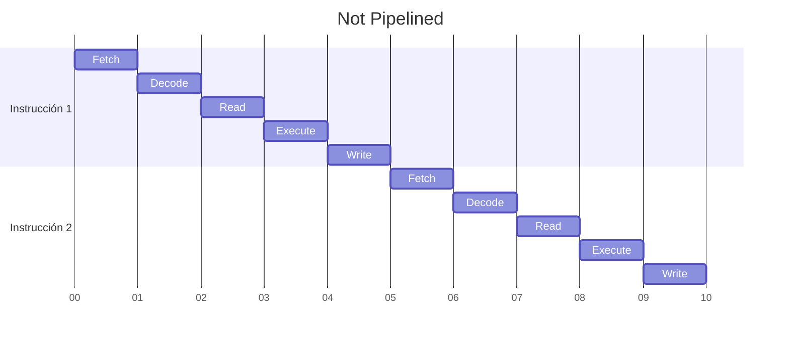
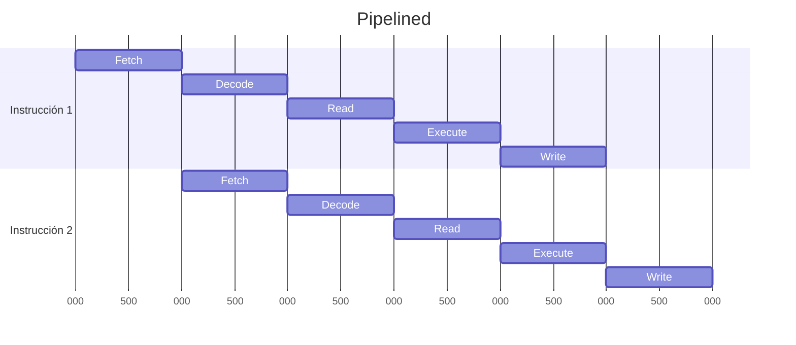

La técnica de *pipeline* apunta a mejorar el rendimiento del [[CPU]] sin aumentar la frecuencia de su reloj.

Un *pipeline* de $k$ etapas consiste en predecir las próximas $k$ instrucciones, de forma que cuando una instrucción finalice la etapa $i$ del [[CPU#Ciclo de Instrucción|Ciclo de Instrucción]], además de iniciar la próxima etapa $i+1$ en dicha instrucción (en caso de que exista una próxima etapa), también se empiece a ejecutar la etapa $i$ correspondiente a la siguiente instrucción predicha (en caso de que esta instrucción este dentro de las $k$ instrucciones predichas).





## Pipeline Hazards
Hay situaciones que generan problemas para el funcionamiento óptimo del *pipeline*.

### Hazards Estructurales
Existe conflicto de hardware entre dos o más etapas del pipeline para alguna combinación de instrucciones.

>[!example] 
>Supongamos que se ejecutan simultáneamente la etapa *read* y *fetch* de las instrucciones $i_1$, $i_2$ respectivamente. Por lo tanto, se produce un conflicto por el uso del [[Arquitectura von Neumann#Bus|Bus de Comunicación]]. Pues $i_1$ desea leer un operando en memoria, mientras que $i_2$ desea leer la instrucción 3 de memoria.

### Hazards de Datos
Existen dependencias de datos entre instrucciones.

- RAW (Read After Write): Ocurre cuando una instrucción posterior lee un valor en memoria que será modificado por una instrucción anterior.

>[!example] 
>  Si tenemos las siguientes instrucciones $i_1$, $i_2$:
>
> ```asm
> mov [0xC8], 7
> add A, [0xC8]
> ```

 Al hacer el *write* de $i_1$ después del *read* de $i_2$ el valor en `[0xC8]` no sería `7`, lo que generaría datos inconsistentes.

- WAR (Write After Read): Ocurre cuando una instrucción posterior escribe un registro que actúa como operando de una instrucción anterior antes que ésta pueda leerlo. *Este tipo de hazard no ocurre en los tipos de pipeline vistos.*
- WAW (Write After Write): Ocurre cuando una instrucción anterior escribe un registro que también actúa como resultado de una instrucción posterior después de ésta.
  Las posibles soluciones a un WAW son las siguientes:
	- *register forwarding*: Consiste en propagar hacia las etapas tempranas del pipeline los resultados apenas estén disponibles.
	- *out of order execution*: Realizar las instrucciones fuera de orden sin alterar el orden lógico. 
  *Este tipo de hazard no ocurre en los tipos de pipeline vistos.*

### Hazards de Control
Surgen al ejecutarse saltos, ya sea incondicionales o condicionales.

Las técnicas para resolver los *hazards de control* incluyen:
- __Prefetch__: Consiste en realizar simultáneamente el *fetch* de la próxima instrucción en memoria y de la instrucción apuntada por la dirección destino del salto. Cuando el salto se efectiviza la instrucción que no corresponde a la secuencia lógica se descarta.
- __Múltiples Flujos__: Consiste en duplicar las etapas del pipeline que están ubicadas hasta la que decide el salto. De esta manera se puede avanzar en la ejecución de ambos flujos de instrucciones.
- __Salto Demorado__: Siempre se ejecuta la instrucción que está luego del salto, en caso de que no exista dicha condición, el compilador deberá colocar un `NOP`.
- __Predicción de Salto__: Consiste en determinar, en base a una política, si el salto se va a tomar o no. Los siguientes mecanismos se utilizan para tomar una decisión:
	- Asumir que siempre o nunca se ejecuta el salto.
	- Predicción basada en la condición del salto: Ciertos tipos de condición tienen mayor tendencia a realizar el salto y otros a no realizarlo.
	- Conmutar Taken / No Taken: Predice el comportamiento de un salto en función de los antecedentes del salto anterior que no tiene por qué ser el mismo. Esto es bueno para bucles, pero no en general.
	- BHT (Branch History Table): Se almacena en una tabla la información de un cierto conjunto de saltos recientemente evaluados.
