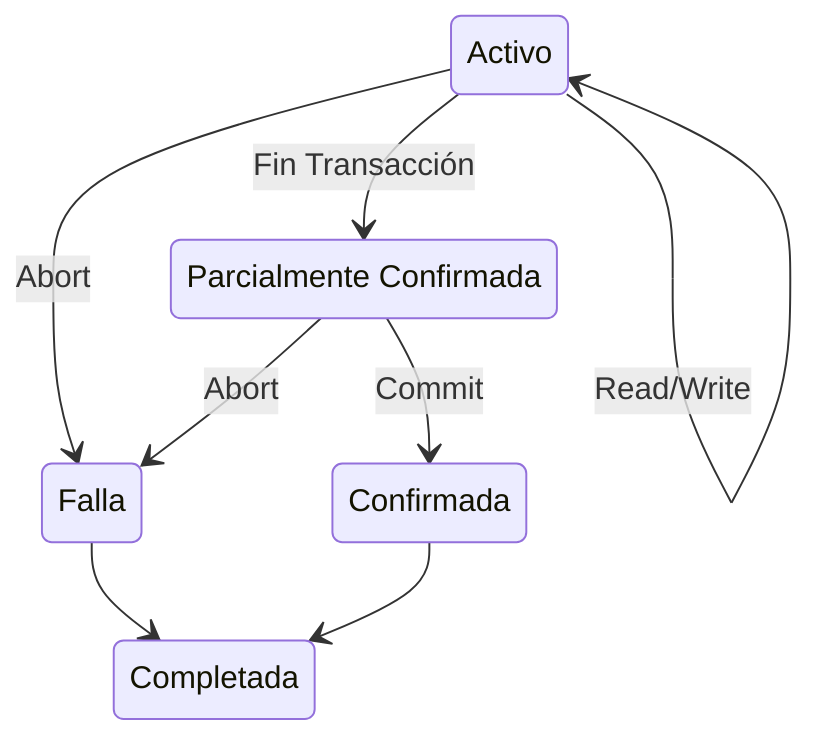

## Transacción
Una transacción es un conjunto de instrucciones que realiza ciertas operaciones sobre la base de datos.

El tiempo de vida de una transacción tiene múltiples estados, estos estados informan al sistema sobre el estado actual de la transacción:



Las propiedades **ACID** de una transacción proveen un método para asegurar consistencia en la base de datos:
- **Atomicity**: La transacción se ejecuta totalmente o no se ejecuta.
- **Consistency**: La base de datos es consistente antes y después de la transacción.
- **Isolation**: Una transacción no debe inferir con otra.
- **Durability**: Una vez que la transacción completó su ejecución, sus cambios en la base de datos deben ser permanentes.

Cuando se ejecutan varias transacciones de forma simultánea, existe el riesgo de violar la integridad de la base de datos. El **Control de Concurrencia en DBMS** es un procedimiento de gestión de transacciones simultáneas asegurando su *atomicidad*, *consistencia*, *aislamiento* y *durabilidad*.   

## Operaciones
- $r_{i}(X)$ (*read*) la transacción $i$ lee el ítem $X$ de la base de datos.
- $w_i(X)$ (*write*) la transacción $i$ escribe el ítem $X$ de la base de datos.
- $c_{i}$ (*commit*) la transacción $i$ confirma que todas sus modificaciones deben ser permanentes en la base de datos.
- $a_{i}$ (*abort*) la transacción $i$ indica que ninguna de sus modificaciones deben ser permanentes en la base de datos.
- $ROLLBACK$ recupera el estado anterior de la base de datos frente a un *abort* de la transacción.


## Historia (Schedule)
Es una secuencia de operaciones que preserva el orden de las operaciones que intervienen en las transacciones.

### Historia Completa
- Tiene todas las operaciones de las transacciones involucradas.
- Las operaciones preservan el orden correspondiente a su transacción.
- Las *operaciones en conflicto* tienen su orden de aparición definido en la historia.

### Historia Serial
Una historia es serial si sus transacciones se ejecutan en forma serial.
```
Si las transacciones se ejecutaran siempre en forma serial, entonces no habría concurrencia pero los datos siempre serían correctos.
```

### Historia Entrelazada
Una historia es serial si sus transacciones se ejecutan en forma entrelazadas.
```
Si las historias son entrelazadas, podría suceder quequeden datos erróneos que no se puedan corregir o quesi una transacción aborta otra también tenga queabortar.
```

### Operaciones en Conflicto 
- Pertenecen a distintas transacciones.
- Acceden al mismo ítem.
- Una de ellas es un *write*.

### Equivalencia de Historias
Podemos verificar que una historia es equivalente a otra utilizando los siguientes métodos:
- Intuitiva: Sí dejan la base de datos en el mismo estado. (difícil de garantizar)
- Por Conflicto: Sí tienen todas las operaciones en conflicto en el mismo orden.
- Por Vistas: Si cada $T_{i}$ lee las mismas $T_{j},...,T_{n}$ en $H$ y $H'$

*Observación:*
	- $T_{1}$ lee de $T_{2}$ si $w_{2}(X)$ está antes de $r_{1}(X)$ y entre medio:
		- No hay otro $w_{j}(X)$ que no es abortado antes de $r_{1}(X)$
		- No está $a_{2}$

### Historia Serializable
Una historia es serializable si esta es *equivalente* a una historia serial con las mismas transacciones.
Una historia es serializable si su *grafo de seriabilidad* es acíclico.

**Creación Grafo de Seriabilidad**
	1. Poner un nodo por cada transacción en la historia.
	2. Si $r_{j}(X)$ está después de $w_{i}(X)$, entonces hay un arco de $T_{i}$ a $T_{j}$
	3. Si $w_{j}(X)$ está después de $r_{i}(X)$, entonces hay un arco de $T_{i}$ a $T_{j}$
	4. Si $w_{j}(X)$ está después de $w_{i}(X)$, entonces hay un arco de $T_{i}$ a $T_{j}$
	*Siempre se pone un arco si hay una pareja de operaciones en conflicto, desde la primera transacción hasta la segunda según el orden de las operaciones en conflicto.*

### Historia Recuperable
Una historia es recuperable si ninguna transacción confirma hasta que confirmaron todas las transacciones desde las cual leyó. 
*Los commit’s están en el mismo orden que el flujo de datos.*

### Historia sin Abortos en Cascada
Una historia evita abortos en cascada si ninguna transacción lee de transacciones no confirmadas.
*Los commit’s tienen que estar antes de los read’s siguientes.*

### Historia Estricta
Una historia es estricta si ninguna transacción lee o escribe hasta que todas las transacciones que escribieron ese ítem fueron confirmadas. 
*Los commit’s tienen que estar antes de los read’s o write’s siguientes.*


