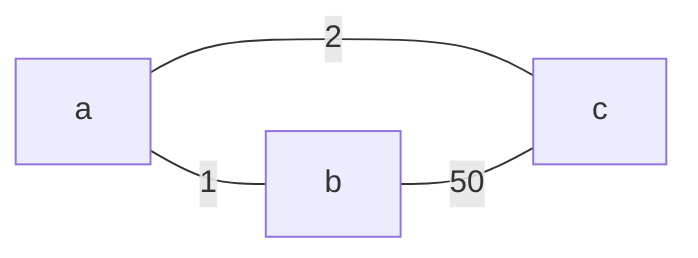

Los *routing algorithms* se utilizan para popular la *routing table* que luego dará lugar a la *forwarding table* determinando la ruta más eficiente que tomarán los paquetes para llegar a destino. Estos algoritmos se clasifican de la siguiente forma:
- *"link state" algorithms*: cada [[Router]] posee la información completa de la topología.
- *"distance vector" algorithms*: la información de la topología es intercambiada por los vecinos del [[Router]].

Al comparar  [[#Link State Algorithms]] y [[#Distance Vector Algorithms]] obtenemos las siguientes diferencias:

Link State|Distance Vector
---|---
Conocimiento de la topología en su totalidad.|Conocimiento únicamente del *next-hop*.
Menor consumo de RAM/CPU.|Mayor consumo de RAM/CPU.
Convergencia lenta.|Convergencia rápida.

## Link State Algorithms
#TODO 
En Dijkstra, cuando la información de enrutamiento en una red oscila implica que las *routing tables* de los routers se actualicen constantemente, este fenómeno se conoce como *route oscillations*. *Por ejemplo, en una red donde el coste de los links depende del volumen de tráfico, puede ocurrir dicho fenómeno.*

## Distance Vector Algorithms
Se basan en la ecuación de *Bellman-Ford* *(dynamic programming).*
Sea $c_{x,v}$ el costo desde $x$ hacia el vecino $v$ de $x$, entonces, el costo del camino menos costoso desde $x$ hacia $y$, es decir, $D_x(y)$ se calcula como:
$$D_x(y) = \underset{v}{min}\{c_{x,v} + D_v(y)\}$$
La idea principal de los *distance vector algorithms* es que cada nodo envíe a sus vecinos su vector distancia cuando este detecta un cambio en su vector distancia. 

Cuando un nodo recibe un vector distancia, este recalcula su vector distancia utilizando la ecuación de *Bellman-Ford* y en caso de su vector distancia cambie, este envía su nuevo vector distancia a sus vecinos.

>[!info] 
>Un nodo no tiene porque saber el camino completo, sino por donde enviar el tráfico entrante.

### Count To Infinity Problem
Supongamos el siguiente escenario.

Podemos observar que una vez convergen los DV's tendrán la siguiente forma:

|  | $a$ | $b$ | $c$ |
| ---- | ---- | ---- | ---- |
| $a$ | 0 | 1 | 2 |
| $b$ | 1 | 0 | 3 |
| $c$ | 2 | 3 | 0 |

Ahora, supongamos que $(a, c)$ cambia su costo a $60$:
- $a$ observa que el link $(a,c)$ ahora tiene costo $60$. Por ende, recalcula su mejor camino hacia $c$, obteniendo $a \xrightarrow{1} b \cdots \xrightarrow{\textcolor{red}{3}} c$, es decir, un costo $\textcolor{red}{4}$. Luego, $a$ emite su nuevo DV a sus vecinos. *Notar que $a$ tiene conocimiento previo de que $b$ posee un camino de costo $3$ hacia $c$.*
- $b$ obtiene el DV de $a$ y observa que $a$ tiene un camino *nuevo* costo hacia $c$. Por ende, recalcula su mejor camino hacia $c$ obteniendo $b \xrightarrow{1} a \cdots \xrightarrow{\textcolor{red}{4}} c$ y emite su nuevo DV a sus vecinos.
- $a$ obtiene el DV de $b$ y observa que $b$ tiene un camino *nuevo* costo hacia $c$. Por ende, recalcula su mejor camino hacia $c$ obteniendo $a \xrightarrow{1} b \cdots \xrightarrow{\textcolor{red}{5}} c$ y emite su nuevo DV a sus vecinos.
- *después de muchas iteraciones...* $b$ obtiene el DV de $a$ y observa que $a$ tiene un camino *nuevo* costo hacia $c$. Por ende, recalcula su mejor camino hacia $c$ obteniendo $b \xrightarrow{\textcolor{green}{50}} c$ y emite su nuevo DV a sus vecinos.

>[!success] 
>Una forma de evitar este problema es la técnica *poison reverse*.
>Cuando el nodo $a$ enruta su tráfico hacia $c$ usando $b$, enviará su DV a $b$ modificando su distancia con $b$ de forma que esta sea infinito.
>
>*Notar que si el DV de $b$ esta enrutando el tráfico hacia $c$ usando $a$, es decir, $b \rightarrow a \cdots \rightarrow c$ ahora observará que $a$ tiene un nuevo camino hacia $c$, lo que implica que deberá recalcular la ruta para llegar a $c$.*

>[!success] 
>Otra forma de evitar este problema es la técnica *split-horizon*. Consiste en no anunciar una ruta por la interfaz de donde la aprendió.
