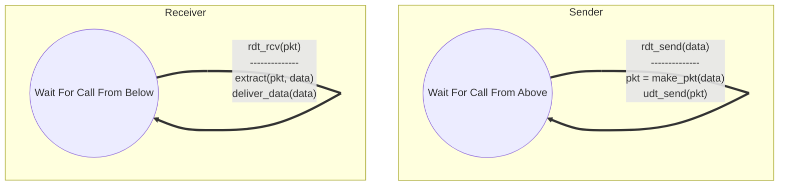
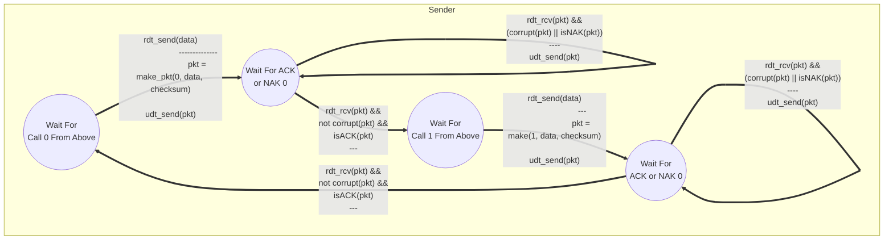

Se utilizan [[Protocolo|Protocolos]] *stop-and-wait* para la transmisión confiable de datos.
## RDT 1.0
Se diseñan los [[Autómata Finito|Autómatas Finitos]] para el receptor y emisor asumiendo que el canal es perfecto.

## RDT 2.1
Se diseñan los [[Autómata Finito|Autómatas Finitos]] para el receptor y emisor asumiendo que el canal puede corromper los mensajes.

## RDT 3.0
Se diseñan los [[Autómata Finito|Autómatas Finitos]] para el receptor y emisor asumiendo que el canal puede corromper los mensajes y/o perderlos.
