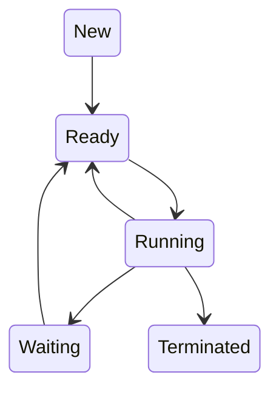

Un *proceso* representa la ejecución de un programa dentro de un sistema operativo.

## Disposición en Memoria
Un proceso en memoria se puede descomponer de la siguiente forma:
- **Text**: Contiene una porción de las instrucciones del proceso.
- **Data**: Incluye variables globales y estáticas.
- **Heap**: Memoria dinámica asignada al proceso durante *runtime*.
- **Stack**: Contiene datos temporales *(ej. parámetros de funciones y variables locales)*.

>[!success] Memory Address Space
>El sistema operativo provee a cada proceso su propia *memory address space* que representa una pequeña porción del *memory address space* del procesador. Por lo tanto, un proceso con un mal comportamiento no afectará el *memory address space* de otro proceso.

## Estados
Mientras un proceso se ejecuta, este puede cambiar de estado.
- **New**: El proceso esta siendo creado.
- **Ready**: El proceso esta esperando ser asignado a un CPU.
- **Running***: Las instrucciones están siendo ejecutadas.
- **Waiting**: El proceso esta esperando por un evento (ej. ES).
- **Terminated**: El proceso finalizó su ejecución.



>[!attention] ¡Atención!
>En un instante dado, en un CPU solo podrá haber un proceso en estado **running**. Sin embargo, varios procesos pueden estar en **waiting** y **ready**.

## Data Structures
### Process Control Block (PCB)
Es una estructura del SO que almacena información de todos los procesos.
- El SO crea un nuevo PCB en la creación de cada proceso y lo coloca en el *state queue*.
- El SO libera el PCB cuando su proceso correspondiente termina.

El PCB contiene la siguiente información:
- Estado del proceso
- Privilegios del proceso
- PID (*process ID*)
- Program Counter del proceso
- [[CPU#Banco de Registros|Registros del CPU]]
- Información sobre el tipo de CPU-Scheduling
- Información sobre la memoria
- Recursos de software  y hardware
- Información del estado de I/O
- Proceso *padre* e *hijos*

### State Queues
El SO mantiene todos los **Process Control Blocks** en *State Queues*, todos los **PCBs** que corresponden al mismo estado se colocan en el mismo *State Queue*.

Cuando el SO cambia el estado de un **PCB**, este se remueve de su cola actual y se inserta en la cola correspondiente a su nuevo estado.

- **Job Queue**: Almacena todos los procesos del sistema.
- **Ready Queue**: Almacena todos los procesos que se encuentran en memoria principal listos para ser ejecutados.
- **Device Queue**: Almacena los procesos que están en estado *waiting* debido a una interrupción I/O. Además, cada dispositivo de I/O tiene su propia *device queue*.

>[!warning] ¡Cuidado!
>En el caso de tener $n$ CPUs podremos tener a lo sumo $n$ PCBs en el **State Queue** correspondiente al estado **running**, puesto que cada CPU puede tener un único proceso en dicho estado

### Context Switch
Es la acción de cambiar el CPU de un proceso $p_1$ *(en estado running)* a un proceso $p_2$ *(en estado ready)*.

El SO guarda el contexto *(registros del CPU, program counter, stack pointer, etc)* de $p_1$ en su correspondiente **PCB**, para luego cargar el contexto de $p_2$. Además, actualiza el estado correspondiente de $p_1$ al estado que le corresponda *(terminated, waiting o ready)* y $p_2$ al estado **running**.

## Creación de Procesos
Un proceso puede crear otros procesos, donde el creador es llamado *padre* y el nuevo procedimiento es llamado *hijo*, formando así un *árbol* de procesos.

El *padre* define los recursos y privilegios a compartir con sus *hijos*. Sin embargo, nunca se comparte la memoria entre ellos.
Además, el *padre* puede esperar a que sus *hijos* completen su trabajo o continuar en paralelo.

Los *hijos* se crean usando una [[Sistema Operativo#System Calls|System Call]] dependiendo del SO.  En el caso de Unix, se provee un [[Sistema Operativo#System Calls|System Call]] *"fork"* (retorna el **PID** del *hijo* creado en el caso del *padre*, y **0** en el caso del *hijo*). Cuando se ejecuta, se copia todo el contexto del *padre* al *hijo* excepto el resultado de *fork*. Además, provee un [[Sistema Operativo#System Calls|System Call]] *exec* que remplaza el espacio de memoria del proceso por uno nuevo.

```c
/* 
	Ejemplo de creación de un proceso en Unix.
*/

#include <sys/types.h>
#include <stdio.h>
#include <unistd.h>

int main() {
	pid_t pid;
	
	/* crear el proceso hijo */
	pid = fork()

	if (pid < 0) { /* error al usar el system call fork*/
		fprintf(stderr, "Fallo el system call fork!");
		return 1;
	}
	else if (pid == 0) { /* proceso hijo */
		execlp("/bin/ls", "ls", NULL);
	}
	else { /* proceso padre */
		/* el padre esperará a que el hijo termine */
		wait(NULL); // wait() acepta &int como parametro,
					// donde guarda el codigo de salida del proceso hijo.
					
		printf("El proceso hijo terminó!");
	}

	return 0;
}
```
