La *concurrencia* es la habilidad de que un sistema logre progreso en multiples tareas durante periodos de tiempo superpuestos.

>[!example]
>Un *chef* se encarga de *cortar zanahorias* y ocasionalmente *revolver la olla*. El *chef* debe dejar de *cortar zanahorias* para *revolver la olla* y luego volver a *cortar zanahorias* y repetir esta secuencia hasta que todo este listo.
>
>En este caso, el *chef* es el único recurso disponible para lograr progreso, y sin hacer el trabajo de forma concurrente, el *chef* debería terminar de *cortar zanahorias* para *revolver la olla*. 

```mermaid
gantt
dateformat x
axisformat %L%
	section Chef
	Cortar Zanahorias: 0, 2
	Revolver: 2, 3
	Cortar Zanahorias: 3, 5
	Revolver: 5, 6
```

## Paralelismo
El *paralelismo* es una subclase de *concurrencia*, es la propiedad de que un sistema este logrando progreso en multiples tareas o sub-tareas en un instante de tiempo dado. Para esto, se necesita un hardware con multiples recursos de computo.

>[!example]
>El *chef A* se encarga de *cortar zanahorias*, mientras que el *chef B* ocasionalmente se encarga de *revolver la olla*. El *chef A* puede *cortar zanahorias* hasta finalizar dicha tarea mientras que el *chef B* se encargará de *revolver la olla* mientras el *chef A* realiza su tarea.
>
>En este caso, tenemos dos recursos disponibles (*chef A* y *chef B*) para lograr progreso en multiples tareas en un instante dado.

```mermaid
gantt
dateformat x
axisformat %L%
	section Chef A
	Cortar Zanahorias: 0, 4
	section Chef B
	Revolver: 0, 4
```

